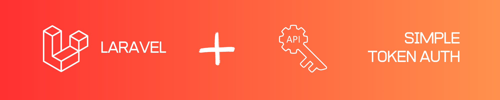

# laravel-simple-auth-tokens



Authentication of routes using API keys (ie: *https://example.com/my/route?api_token=XXXX*) can be achieved simply using Laravel's built-in `'token'` authentication driver.

This package enables this functionality by providing a simple **migration** to add the required `api_token` field to your `users` table.


We often enable session-based (as well as token-based) authentication on our API routes, but Laravel's `StartSession` middleware creates new sessions every time a request is made from an API clients (because it typically doesn't support cookies).  This can quickly result in the creation of thousands of sessions.

To solve this issue, this package provides a replacement `StartSession` **middleware** that prevents sessions from being created when `api_token=XXXX` is detected in a given request.


### Installation + Configuration:

```bash
composer require faithfm/laravel-simple-auth-tokens
php artisan migrate              # adds 'api_token' field to 'users' table
```

Modify `Models\User.php` to include the new `api_token` field:

```diff
    protected $fillable = [
        'name',
        'email',
        'password',
+       'api_token',
    ];
```

For **Laravel 8** onwards, add a token-based guard to `config/auth.php`.  *(This config was included by default in prior versions.)*

    'guards' => [
        ...
        'api' => [
            'driver' => 'token',
            'provider' => 'users',
            'input_key' => 'api_token',       // Default value - not strictly required
            'storage_key' => 'api_token',     // Default value - not strictly required
            'hash' => false,                  // Default value - not strictly required
        ],

Modify `App\Http\Kernel.php` to replace the `StartSession` middleware for WEB routes:

```diff
protected $middlewareGroups = [
    'web' => [
        \App\Http\Middleware\EncryptCookies::class,
        \Illuminate\Cookie\Middleware\AddQueuedCookiesToResponse::class,
-       // \Illuminate\Session\Middleware\StartSession::class,          // replace Laravel default with...
+       \FaithFM\SimpleAuthTokens\Http\Middleware\StartSession::class,  // ...FaithFM\SimpleAuthTokens class - which prevents creation of (numerous) session files for requests containing 'api_token=XXXX'  (ie: clients without support for cookies will normally result in creation of a session-file for every API call - potentially resulting in hundreds/thousands of session-files)
        \App\Http\Middleware\VerifyCsrfToken::class,
        \Illuminate\Routing\Middleware\SubstituteBindings::class,
        \App\Http\Middleware\HandleInertiaRequests::class,
    ],
    ...
],
```

**(Optionally)** modify `App\Http\Kernel.php` to add the session-based middleware for API routes (if you want to enable session-based as well as token-based authentication in API routes):

```diff
protected $middlewareGroups = [
    ...    
    'api' => [
        // \Laravel\Sanctum\Http\Middleware\EnsureFrontendRequestsAreStateful::class,
        \Illuminate\Routing\Middleware\ThrottleRequests::class.':api',
        \Illuminate\Routing\Middleware\SubstituteBindings::class,
        
+       // OPTIONAL session-related middleware for API routes - recommended by FaithFM\SimpleAuthTokens
+       \App\Http\Middleware\EncryptCookies::class,
+       \Illuminate\Cookie\Middleware\AddQueuedCookiesToResponse::class,
+       \FaithFM\SimpleAuthTokens\Http\Middleware\StartSession::class,		// FaithFM\SimpleAuthTokens class
+       \Illuminate\View\Middleware\ShareErrorsFromSession::class,
+       \App\Http\Middleware\VerifyCsrfToken::class,
    ],
],
```

For **Laravel 11** onwards, modify  `bootstrap/app.php` [instead](docs/laravel-11-bootstrap-app.md)...  [NOT FULLY TESTED]


### Usage:

Assuming session and token guards have been configured as `'web'` and `'api`' respectively (ie: Laravel defaults), you can use [Laravel's normal authentication](https://laravel.com/docs/master/authentication) methods as follows:

```php
$loggedIn = auth('api')->check();           // check if logged in  (using helper function)
$loggedIn = Auth::guard('api')->check();    // ditto  (using Facades)
$user = auth('api')->user();                // get current User using helper function
$user = Auth::guard('api')->user();         // ditto (using Facades)

// Protect routes using 'auth' middleware
Route::get(...)->middleware('auth:api')     // use token-based 'api' guard
Route::get(...)->middleware('auth:web,api') // allow either session-based or token-based guards

```

When multiple alternative guards have been specified via middleware (ie: the last example above), all authentication calls inside this route are implicitly resolved using the first authenticated guard that was found:      *(The middleware calls the shouldUse() method which overrides the configured default guard.)*

```php
Route::get('/showuser', function () {
    return auth()->user();	// web  OR api guard will automatically be used depending on first authenticated guard found during middleware check
})->middleware('auth:web,api');
```

We also have created an extended `auth_guards()` helper that allows **multiple guards** to be specified, since unfortunately neither Laravel's `guard()` helper nor `Auth::guard()` facade support multiple guards outside of a middleware-protected-route - ie:

```php
$user = auth()->user();                 // default guard   = SUPPORTED
$user = auth('api')->user();            // specific guard  = SUPPORTED
$user = auth('web,api')->user();        // multiple guards = NOT SUPPORTED
$user = auth_guards('web,api')->user(); // multiple guards = SUPPORTED (extended helper)
```


### How It Works:

Laravel's built-in `'token'` authentication driver is:

*  Defined in `Illuminate\Auth\TokenGuard.php`
* Registered by the `createTokenDriver()` method in `Illuminate\Auth\AuthManager.php`, when the `resolve()`  method matches a driver with `$name = 'token'`.

This `'token'` driver attempts to authenticate a request using the following approach:

* Look for `'api_token=XXXX'` request parameters  (ie: "https://example.com/my/route?api_token=XXXX").
* Attempt to match the provided API key against the `api_token` field in the `users` table / (`User` model).
* Authentication is successful if a user is found with a valid matching `api_token`


Our `FaithFM\SimpleAuthTokens\Http\Middleware\StartSession` middleware works as follows:

* Detect the presence of an `api_token=XXXX` request parameter.
* Force Laravel session to use the memory-based `'array'` driver for the request  (instead persistent file/database/etc driver).

> Note: a side-effect of our `StartSession` middleware this is that if you load a route from a browser that already has a valid / logged-in session, this session becomes invisible if you add an `api_token=XXXX` request parameter to the URL.  (ie: authentication can't fall-back to the session if the api_token has been specified)
